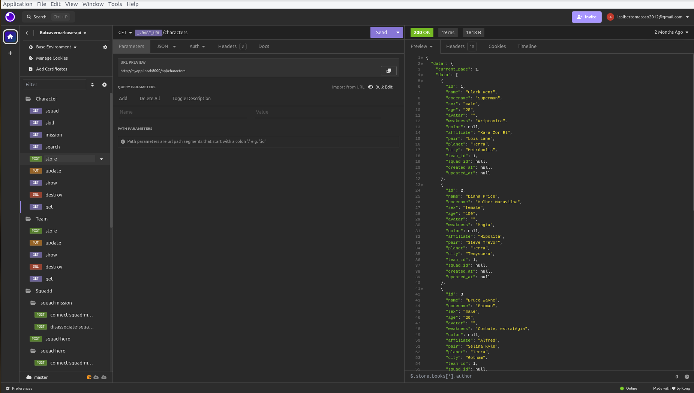

<p align="center"><a href="https://laravel.com" target="_blank">
</a></p>
<h1 align="center">BATCAVERNA API</h1>

## O sistema usado pelo Batman e pela Liga da Justiça em suas missões!

<p>Gerencie seus heróis em missão de maneira organizada, Acompanhe seus squads em frentes de batalha.</p>
<p>
O sistema ainda está em desenvolvimento, então se sinta a vontade para criar uma issue, um fork ou pull request. Viva o mundo opensource!
</p>

Laravel is accessible, powerful, and provides tools required for large, robust applications.

## Frontend

**Disponível [aqui](https://github.com/lcAlberto/batcaverna)**. Sinta-se a vontade para clonar, criar forks e pull requests.

## Setup

### 1. Antes de começarmos é importante que seu ambiente atenda os seguintes requisitos:

- **PHP**: versão 7.2.5 ou superior
- **Composer**: ferramenta de gerenciamento de dependências para PHP
- **MySQL**: versão 5.7 ou superior (ou qualquer outro banco de dados suportado pelo Laravel)
- **Extensões PHP**:
  - OpenSSL
  - PDO
  - Mbstring
  - Tokenizer
  - XML
  - Ctype
  - JSON
  - BCMath


## Preparando as variáveis de ambiente
```bash
# copiar o .env
cp .env.example .env
```

## Instalando as dependências
Instalar as dependencias do composer
```bash
# composer
composer install
```

## Gerando a key da aplicação
Gere a chave da aplicação com o comando:
```bash
# artisan
php artisan key:generate
```

## Configurando o banco de dados no arquivo `.env`
Configure seu banco de dados no arquivo `.env`
```bash
# .env
DB_CONNECTION=mysql
DB_HOST=localhost
DB_PORT=3306
DB_DATABASE='nome-do-seu-database'
DB_USERNAME='usuário-do-seu-database'
DB_PASSWORD='senha-do-seu-database'
```

## Migrando o banco de dados
Para migrar as tabelas e já semear alguns dados para ilustrar o uso da aplicação, bem como algumas relações entre as tabelas use:
```bash
# artisan
php artisan migrate:fresh --seed
```

## Rodando o servidor

Start the development server on `http://localhost:8000`:

```bash
# npm
php artisan serve
```

## Importando Endpoints no Insomnia

Para importar a coleção de endpoints no Insomnia, siga os passos abaixo:

1. A colection de endpoints se encontra na raiz do projeto, em `endpoints/Insomnia_endpoints_doc.json`.
2. No Insomnia, clique em `Import/Export` (ícone no canto superior direito).
3. Selecione `Import Data` e, em seguida, `From File`.
4. Escolha o arquivo `endpoints/Insomnia_endpoints_doc.json` na raiz do projeto.



Após a importação, você verá todos os endpoints disponíveis para teste.


# Planos em desenvolvimento

- Criei um board no [Trelo](https://trello.com/) com as features pendentes e as features que estou trabalhando para que o projeto sempre evolua. Ele pode ser encontrado [aqui](https://trello.com/invite/b/6695fa4f12ec2d55297e363f/ATTIbd3b5c47858fa18b0145622348c9cee9F514C36F/batcaverna-api).
- Criar testes unitários
- Aplicar técnicas de padrões de projetos

## License

The Laravel framework is open-sourced software licensed under the [GPL](LICENSE.md).
